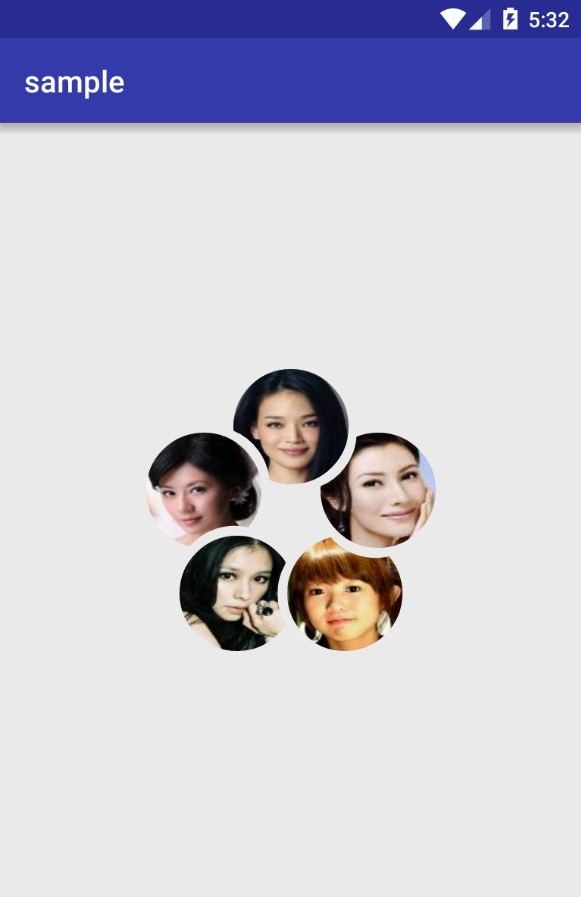

# Glide Module

## QQ Group icon

You can use this module load List<String> than image like QQ group icon



## How to use

in build.gralde

```
repositories {
    maven { url "https://dl.bintray.com/jiechic/maven" }
}
```
 
```
dependencies {
    compile 'com.jiechic.library.glide:qqgroupicon-integration:0.1'
}
```

in code

```
List<String> list = new ArrayList<>();
list.add("http://list.image.baidu.com/t/image_category/galleryimg/womenstar/hk/shu_qi.jpg");
list.add("http://list.image.baidu.com/t/image_category/galleryimg/womenstar/hk/jia_jing_wen.jpg");
list.add("http://list.image.baidu.com/t/image_category/galleryimg/womenstar/hk/xu_ruo_xuan.jpg");
list.add("http://list.image.baidu.com/t/image_category/galleryimg/womenstar/hk/guo_shu_yao.jpg");
list.add("http://list.image.baidu.com/t/image_category/galleryimg/womenstar/hk/li_jia_xin.jpg");

Glide.with(this)
     .load(list)
     .into(imageView);
```